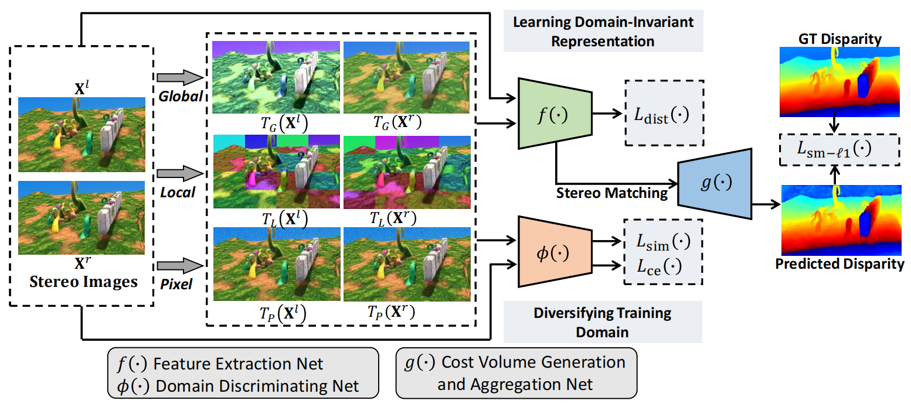

### Domain Generalized Stereo Matching via Hierarchical Visual Transformation (CVPR 2023)



#### Dependencies:
- Python 3.9
- PyTorch 1.13.0
- torchvision 0.14.0
- matplotlib 
- opencv-python 
- pillow 

#### Datasets:
- [SceneFlow](https://lmb.informatik.uni-freiburg.de/resources/datasets/SceneFlowDatasets.en.html)
- [KITTI stereo 2015](http://www.cvlibs.net/datasets/kitti/eval_scene_flow.php?benchmark=stereo)
- [KITTI stereo 2012](http://www.cvlibs.net/datasets/kitti/eval_stereo_flow.php?benchmark=stereo)
- [Middlebury v3](https://vision.middlebury.edu/stereo/submit3/)
- [ETH3D](https://www.eth3d.net/datasets#low-res-two-view)

#### Training:
```bash
python main.py --data_path (your SceneFlow data folder) --savemodel (the path of the saved models) --logfile (the path of the log file) --res18 (the path of the Pretrained ResNet18 Model)
```

#### Evaluation:
In the training stage, our code will automatically test the performance of four realistic datasets (Middlebury, ETH3D, KITTI2015, KITTI2012) after each epoch.

You only need to change the corresponding paths of the testing datasets in main.py.

If you want to evaluate the specific model on a certain realistic dataset:
```bash
python submission.py --loadmodel (your testing model) --test_name (the name of testing dataset) --logfile (the path of the log file) 
```

#### Pretrained Models:
[Google Drive](https://drive.google.com/drive/folders/1Wnf2wpppXrZPguwLTQgEhxgjBAfENGHN?usp=drive_link)

#### Pretrained ResNet18 Model:
[Google Drive](https://drive.google.com/drive/folders/14puLJ5ccffh8Bc1P2hhPoK73gSC1TImf?usp=sharing)

## Citation

If you find our work useful in your research, please consider citing our paper:

```bibtex
@inproceedings{chang2023domain,
  title={Domain Generalized Stereo Matching via Hierarchical Visual Transformation},
  author={Chang, Tianyu and Yang, Xun and Zhang, Tianzhu and Wang, Meng},
  booktitle={Proceedings of the IEEE/CVF Conference on Computer Vision and Pattern Recognition},
  pages={9559--9568},
  year={2023}
}
```

# Acknowledgements

This project is built upon [PSMNet](https://github.com/JiaRenChang/PSMNet), we thank the original authors for their excellent work.
